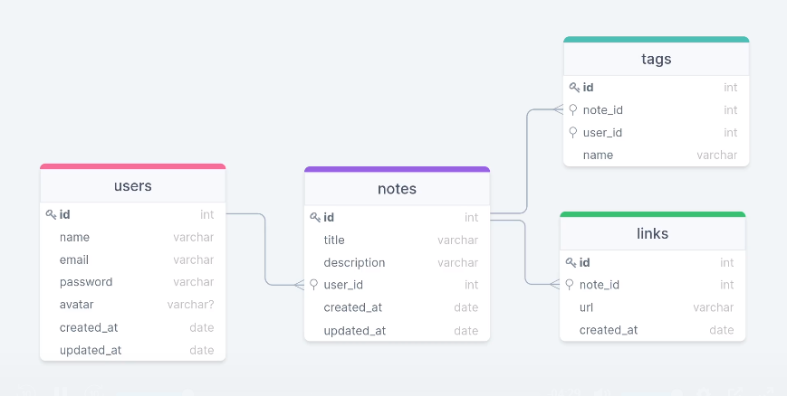

<h1 align="center"> Backend - API - RocktNotes </h1>

<h2 id="project">Projeto</h2>

Aplicação em Node.js onde o usuário realiza seu cadastro com os dados: nome, e-mail, senha e sua foto de perfil.
Cadastra uma anotação, preenche com algumas informações como: nome, descrição, criação de tags relacionadas e links. 

<h2 id="structure">Diagrama</h2>

Abaixo diagrama utiliazado para criação do banco de dados:



<h2 id="usage">Utilização</h2>

1. instale as dependências com: ``` npm install ```
2. inicie o projeto com: ``` npm run dev ```
3. execute a migrations para criação do banco de dados: ``` npm run migrations ```

<h2 id="technologies">Tecnologias</h2>

Esse projeto foi desenvolvido com as seguintes tecnologias:

- Node.js;
- Express;
- SQLite;
- Knex.js;
- Multer;
- Json Web Token;

> Desafio do nível 8 e 9 - Backend do Explorer da Rocketseat